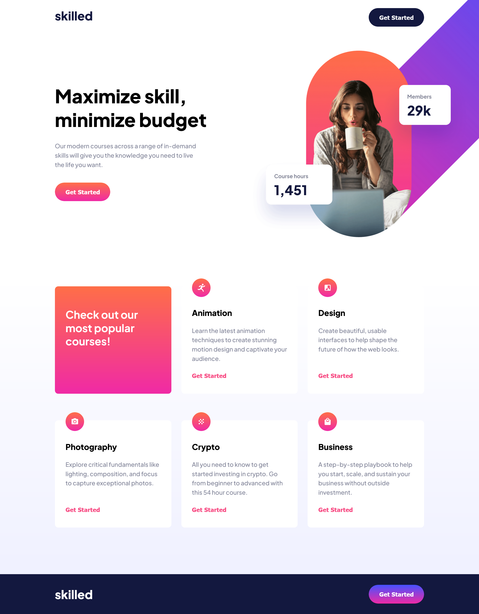

# Frontend Mentor - Skilled e-learning landing page solution

This is a solution to the [Skilled e-learning landing page challenge on Frontend Mentor](https://www.frontendmentor.io/challenges/skilled-elearning-landing-page-S1ObDrZ8q). Frontend Mentor challenges help you improve your coding skills by building realistic projects.

## Table of contents

- [Overview](#overview)
  - [The challenge](#the-challenge)
  - [Screenshot](#screenshot)
  - [Links](#links)
- [My process](#my-process)
  - [Built with](#built-with)
  - [What I learned](#what-i-learned)
  - [Continued development](#continued-development)
- [Author](#author)

## Overview

### The challenge

Users should be able to:

- View the optimal layout depending on their device's screen size
- See hover states for interactive elements

### Screenshot

### Links

- Solution URL: (https://www.frontendmentor.io/solutions/responsive-landing-page-built-mobilefirst-with-flexbox-Cx9cn_A-xd)
- Live Site URL: (https://victoria-sardelli.github.io/skilled-e-learning-landing/)

## My process

### Built with

- Semantic HTML5 markup
- Flexbox
- Mobile-first workflow

### What I learned

Two especially new and interesting challenges for me were:
1. to display a half-opaque white overlay on the buttons upon hover
2. to allow the banner image to "leak" into the section of text on its left, as well as the header above, while still controlling overflow on both tablet and desktop

From this project, I learned a lot about positioning elements on the screen. I especially got to practice (and better appreciate!) the use of relative and absolute positioning. It was also one of the first times I used the flexbox gap property, which really came in handy for laying the square tiles out onto the screen with the right amount of space in between.

### Continued development

I'd like to continue practicing using the BEM naming convention for CSS classes. I'd also like to continue learning flexbox techniques, and how to achieve various layouts, positionings, and responsive features.

## Author

- Frontend Mentor - [@Victoria-Sardelli](https://www.frontendmentor.io/profile/Victoria-Sardelli)